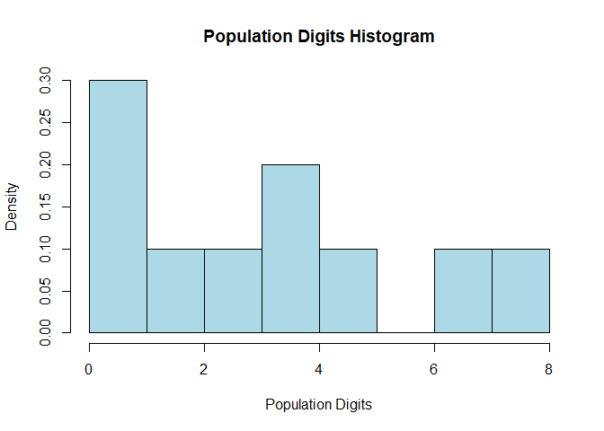
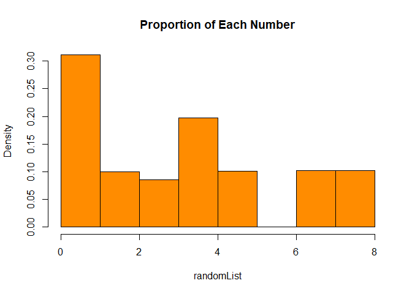
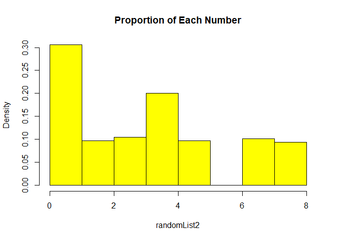

``` r
# Use this as total population.
population <- c(1, 0, 0, 4, 0, 6, 7, 3, 3, 2)
```

``` r
# Generate a histogram to visually discribe the population digits.
hist(population, main = "Population Digits Histogram",
     breaks = c(0,1,2,3,4,5,6,7,8), xlim = range(0:8),
     xlab = "Population Digits",col = "lightblue",
     freq = FALSE, right = F)
```



``` r
# Find the proportion of 0's and 1's.
countZero = 0
countOne = 0
N = length(population)
for(each in population)
{
  if (each == 0) {countZero = countZero + 1
  } else if (each == 1) {countOne = countOne + 1}
}
propZero = countZero/N
propOne = countOne/N

cat("The proportion of 0 is:",propZero)
```

    ## The proportion of 0 is: 0.3

``` r
cat("The proportion of 1 is:", propOne)
```

    ## The proportion of 1 is: 0.1

``` r
# Draw a random sample of 4 digits with replacement.
set.seed(1)
rdmSpl = sample(population, size = 4, replace = T)
countOne2 = 0
for (element in rdmSpl) {
  if (element == 1) {countOne2 = countOne2 + 1}
}
propOne2 = countOne2/length(rdmSpl)

cat("Random sample of 4 digits with replacement:", rdmSpl)
```

    ## Random sample of 4 digits with replacement: 3 4 7 1

``` r
cat("Proportion of 1 is:", propOne2)
```

    ## Proportion of 1 is: 0.25

``` r
# Generate 1000 random samples of 4 digits with replacement.
set.seed(2)
i = 0
randomList = NULL
repeat{
  rdmSpl2 = sample(population, size = 4, replace = T)
  randomList = c(randomList,rdmSpl2)
  i = i + 1
  if (i == 1000){
    break
  }
}
```

``` r
# Plot the sample proportion of 1's using a histogram.
hist(randomList, main = "Proportion of Each Number", xlim = c(0,8),
     col = "darkorange", freq = FALSE, right = F,
     breaks = c(0,1,2,3,4,5,6,7,8))
```



``` r
# Draw a random sample of 4 digits without replacement.
set.seed(6)
rdmSplx = sample(population, size = 4, replace = F)
countOnex = 0
for (element in rdmSplx) {
  if (element == 1) {countOnex = countOnex + 1}
}
propOnex = countOnex/length(rdmSplx)

cat("Random sample of 4 digits with replacement:", rdmSplx)
```

    ## Random sample of 4 digits with replacement: 0 3 4 3

``` r
cat("Proportion of 1 is:", propOnex)
```

    ## Proportion of 1 is: 0

``` r
# Generate 1000 random samples of 4 digits without replacement.
set.seed(3)
i = 0
randomList2 = NULL
repeat{
  rdmSpl3 = sample(population, size = 4, replace = F)
  randomList2 = c(randomList2, rdmSpl3)
  i = i + 1
  if (i == 1000){
    break
  }
}
```

``` r
# Plot the sample proportion of 1's using a histogram.
hist(randomList2, main = "Proportion of Each Number", xlim = c(0,8),
     col = "yellow", freq = FALSE, breaks = c(0,1,2,3,4,5,6,7,8),
     right = F)
```


